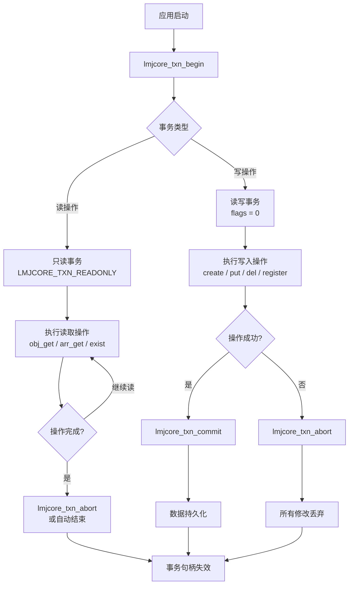

# LMJCore 事务模型

——完全继承 LMDB 的 MVCC 与 ACID 语义

---

## 一、核心设计理念

LMJCore 的事务系统**完全继承并透传 LMDB 的事务语义**，不做任何额外封装或修改。这意味着：

- **ACID 完整保证**：原子性、一致性、隔离性、持久性全部由 LMDB 内核保障
- **MVCC 多版本并发控制**：读写不互斥，读事务不阻塞写事务
- **零拷贝内存映射**：读操作直接访问内存，无数据拷贝开销
- **崩溃一致性**：无需预写日志（WAL），系统崩溃后重启即可恢复

> 💡 对熟悉 LMDB 的开发者：LMJCore 的事务 API 是 LMDB 事务接口的直接映射，保持了语义一致性。

---

## 二、事务生命周期



### 2.1 事务创建

```c
int lmjcore_txn_begin(lmjcore_env *env, lmjcore_txn *parent, 
                      unsigned int flags, lmjcore_txn **txn);
```

|参数|说明|
|---|---|
|`env`|环境句柄（由 `lmjcore_init` 返回）|
|`parent`|父事务（嵌套事务用，通常为 `NULL`）|
|`flags`|事务标志（见下表）|
|`txn`|输出参数，返回新事务句柄|

**事务标志**

|标志|值|说明|
|---|---|---|
|`LMJCORE_TXN_READONLY`|`MDB_RDONLY`|只读事务，可并发执行|
|`LMJCORE_TXN_NOSYNC`|`MDB_NOSYNC`|提交时不强制 fsync（覆盖环境设置）|
|`LMJCORE_TXN_NOMETASYNC`|`MDB_NOMETASYNC`|提交时不同步元数据|
|`LMJCORE_TXN_MAPASYNC`|`MDB_MAPASYNC`|使用异步内存同步|
|`LMJCORE_TXN_NOTLS`|`MDB_NOTLS`|事务不绑定到线程|
|`LMJCORE_TXN_DEFAULT`|`0`|默认事务，遵循环境设置|

> ⚠️ **写事务必须使用 `LMJCORE_TXN_DEFAULT`（即 flags = 0）**。若传入 `LMJCORE_TXN_READONLY`，后续写入操作将返回 `LMJCORE_ERROR_READONLY_TXN`。

### 2.2 事务提交与中止

```c
int lmjcore_txn_commit(lmjcore_txn *txn);  // 提交事务，使所有修改持久化
int lmjcore_txn_abort(lmjcore_txn *txn);   // 中止事务，丢弃所有未提交修改
```

**行为规则**：
- 提交/中止后，事务句柄**立即失效**，不可再用于任何操作
- 重复提交/中止同一事务会导致未定义行为（LMDB 原生语义）
- 提交失败时，事务会自动回滚，调用者仍需调用 `lmjcore_txn_abort` 释放资源

### 2.3 事务类型判断

```c
bool lmjcore_txn_is_read_only(lmjcore_txn *txn);
```

- 返回 `true`：事务为只读类型
- 返回 `false`：事务为读写类型

---

## 三、嵌套事务（子事务）

LMJCore 支持 LMDB 的嵌套事务机制，用于实现原子性复合操作：

```c
// 顶级写事务
lmjcore_txn *root_txn;
lmjcore_txn_begin(env, NULL, 0, &root_txn);

// 在顶级事务中开启子事务
lmjcore_txn *child_txn;
lmjcore_txn_begin(env, root_txn, 0, &child_txn);

// 在子事务中执行写入
lmjcore_obj_member_put(child_txn, obj_ptr, "temp", 4, value, len);

// 子事务提交（修改对父事务可见）
lmjcore_txn_commit(child_txn);

// 继续在父事务中操作...

// 父事务提交（所有修改持久化）
lmjcore_txn_commit(root_txn);
```

### 3.1 嵌套规则

|父事务类型|允许的子事务类型|说明|
|---|---|---|
|**写事务**|**读事务**或**写事务**|写事务可开启任意类型的子事务|
|**只读事务**|**不允许**|只读事务不能开启任何子事务|

> ❌ 若尝试在只读父事务中开启子事务，将返回 `LMJCORE_ERROR_READONLY_PARENT`。

### 3.2 提交与回滚语义

- **子事务提交**：修改合并到父事务，但对其他事务仍不可见（直到顶级事务提交）
- **子事务回滚**：子事务的所有修改被丢弃，不影响父事务状态
- **父事务回滚**：丢弃所有子事务的修改（无论子事务是否已提交）

---

## 四、隔离性保证

LMJCore 完全继承 LMDB 的 **快照隔离（Snapshot Isolation）** 语义：

|场景|行为|
|---|---|
|**读事务 vs 写事务**|读事务看到的是事务开始时的数据库快照，不受后续写事务影响|
|**写事务 vs 写事务**|LMDB 全局单写，写事务串行执行|
|**写事务 vs 读事务**|写事务提交后，新开启的读事务可见；已存在的读事务不可见|

### 4.1 读写并发模型

```
时间线 →
────────────────────────────────────────────────────
T1: 开启读事务 (快照 S1) → 读取数据 A → 读取数据 B → 提交
T2:                             开启写事务 → 修改数据 A → 提交
T3:                                           开启读事务 (快照 S3) → 读取数据 A (已修改)
```

- T1 读事务：始终看到快照 S1 的数据，T2 的修改对它不可见
- T3 读事务：看到 T2 提交后的数据（因它在 T2 提交后才开始）

### 4.2 写写并发

LMDB 采用**单写者（Single Writer）** 模型：
- 同一时刻最多只有一个活跃的写事务
- 写事务之间天然串行，无需应用层加锁
- 写事务尝试开始时，若有其他写事务未提交，则阻塞等待

> ✅ 此设计简化了并发控制，开发者无需担心写写冲突。

---

## 五、事务中的数据可见性规则

### 5.1 新创建实体的可见性

```c
// 事务 T1 中创建对象
lmjcore_obj_create(txn1, obj_ptr);

// T1 未提交时，其他事务能否看到该对象？
lmjcore_entity_exist(txn2, obj_ptr);  // 返回 0（不存在）

// T1 提交后
lmjcore_txn_commit(txn1);

// 新开启的事务 T3 中
lmjcore_entity_exist(txn3, obj_ptr);  // 返回 1（存在）
```

**规则**：
- 写事务中创建的实体，在事务提交前**仅对该事务自身可见**
- 提交后，对所有**之后开启**的事务立即可见
- 已存在的读事务（在提交前开启）仍然看不到新数据

### 5.2 修改的可见性

```c
// 事务 T1 中修改成员值
lmjcore_obj_member_put(txn1, obj_ptr, "count", 5, &new_val, 4);

// T1 未提交时，其他事务读取
lmjcore_obj_member_get(txn2, obj_ptr, "count", 5, buf, size, &len);  
// 返回原值，看不到修改

// T1 提交后，新事务读取到新值
```

**规则**：修改遵循与创建相同的 MVCC 可见性规则

---

## 六、事务边界的最佳实践

### 6.1 读事务的最佳长度

```c
// ❌ 不建议：读事务持续时间过长
lmjcore_txn_begin(env, NULL, LMJCORE_TXN_READONLY, &txn);
// ... 长时间处理（如网络等待、复杂计算）...
lmjcore_obj_get(txn, ptr, buf, size, &result);
lmjcore_txn_abort(txn);  // 读事务必须显式中止
```

**问题**：长事务会阻止 LMDB 清理旧数据页，可能导致数据库文件膨胀。

✅ **推荐实践**：
- 读事务应**尽可能短小**，完成必要读取后立即中止
- 避免在读事务中执行阻塞操作（如 I/O、网络调用）
- 若需长时间处理数据，先将数据复制到应用层缓冲区，然后中止事务

### 6.2 写事务的最佳长度

```c
// ✅ 推荐：写事务只包含必要的写入操作
lmjcore_txn_begin(env, NULL, 0, &txn);
lmjcore_obj_member_put(txn, obj1, "x", 1, val1, len1);
lmjcore_obj_member_put(txn, obj2, "y", 1, val2, len2);
lmjcore_txn_commit(txn);  // 快速提交
```

**原则**：
- 写事务应尽量短小，减少阻塞其他写事务的时间
- 避免在写事务中执行耗时的非数据库操作
- 合理使用嵌套事务实现原子性复合操作

### 6.3 批量写入策略

```c
// ✅ 推荐：批量写入使用单一事务
lmjcore_txn_begin(env, NULL, 0, &txn);
for (int i = 0; i < 10000; i++) {
    lmjcore_arr_append(txn, arr_ptr, elements[i], len[i]);
}
lmjcore_txn_commit(txn);  // 一次提交，原子性保证
```

**优势**：
- 批量操作原子性（要么全部成功，要么全部失败）
- 减少事务提交开销
- 写入性能提升（LMDB 在事务内批量写入效率高）

---

## 七、错误处理与事务状态

### 7.1 事务相关错误码

|错误码|值|说明|
|---|---|---|
|`LMJCORE_ERROR_READONLY_TXN`|-32020|在只读事务中尝试写操作|
|`LMJCORE_ERROR_READONLY_PARENT`|-32021|父事务是只读，不能开子事务|
|`MDB_MAP_RESIZED`|-30782|数据库映射空间不足（需增大 map_size）|
|`MDB_TXN_FULL`|-30780|事务过大，超过 LMDB 限制|

### 7.2 事务中止后的状态

事务中止后：
- 所有未提交的修改**全部丢弃**
- 事务句柄**立即失效**
- 任何使用已中止事务句柄的操作返回未定义行为

```c
lmjcore_txn_abort(txn);
// 此时 txn 已失效
lmjcore_obj_get(txn, ptr, buf, size, &result);  // ❌ 未定义行为，可能崩溃
```

### 7.3 嵌套事务中的错误处理

```c
lmjcore_txn_begin(env, NULL, 0, &root_txn);
lmjcore_txn_begin(env, root_txn, 0, &child_txn);

int rc = lmjcore_obj_member_put(child_txn, obj_ptr, "key", 3, val, len);
if (rc != LMJCORE_SUCCESS) {
    // 子事务中出错，回滚子事务
    lmjcore_txn_abort(child_txn);
    // 父事务可继续使用，或整体回滚
    lmjcore_txn_abort(root_txn);
    return rc;
}

lmjcore_txn_commit(child_txn);
lmjcore_txn_commit(root_txn);
```

---

## 八、与 LMDB 事务的对应关系

| LMJCore API                | LMDB API         | 说明         |
| -------------------------- | ---------------- | ---------- |
| `lmjcore_txn_begin`        | `mdb_txn_begin`  | 直接映射，标志位透传 |
| `lmjcore_txn_commit`       | `mdb_txn_commit` | 提交后释放事务句柄  |
| `lmjcore_txn_abort`        | `mdb_txn_abort`  | 中止后释放事务句柄  |
| `lmjcore_txn_is_read_only` | 无直接对应            | 封装了事务内部状态  |

**标志位映射**：
```c
// LMJCore 事务标志直接对应 LMDB 标志
#define LMJCORE_TXN_READONLY   MDB_RDONLY
#define LMJCORE_TXN_NOSYNC     MDB_NOSYNC
#define LMJCORE_TXN_NOMETASYNC MDB_NOMETASYNC
// ... 以此类推
```

---

## 九、性能优化建议

### 9.1 读事务优化

- **使用只读事务**：读操作必须使用 `LMJCORE_TXN_READONLY`，避免不必要的写事务开销
- **复用读事务**：若多次读取互相关联的数据，可复用同一读事务保证一致性视图
- **及时中止**：读取完成后立即调用 `lmjcore_txn_abort`

### 9.2 写事务优化

- **批量写入**：将多个写入操作合并到同一事务
- **适当使用子事务**：实现原子性复合操作，但不滥用（子事务有额外开销）
- **监控事务大小**：避免单个事务过大（超过 1GB 可能导致 `MDB_TXN_FULL`）

### 9.3 环境标志对事务的影响

```c
// 高性能配置（牺牲持久性）
#define LMJCORE_ENV_MAX_PERF (LMJCORE_ENV_WRITEMAP | LMJCORE_ENV_MAPASYNC | \
                               LMJCORE_ENV_NOSYNC | LMJCORE_ENV_NOMETASYNC)

// 安全模式（默认）
#define LMJCORE_ENV_SAFE 0
```

|环境标志|对事务的影响|
|---|---|
|`LMJCORE_ENV_NOSYNC`|事务提交时不强制刷盘，提升性能但可能丢数据|
|`LMJCORE_ENV_WRITEMAP`|直接写入内存映射，减少拷贝，需配合 `MAPASYNC`|
|`LMJCORE_ENV_MAPASYNC`|异步写回磁盘，进一步提升性能|

---

## 十、常见问题解答

### Q1: 只读事务中能否调用 `lmjcore_entity_exist`？

✅ 可以。`lmjcore_entity_exist` 是读操作，只读事务中完全合法。

### Q2: 写事务开启后忘记提交/中止会怎样？

事务句柄会一直占用资源，阻止 LMDB 清理旧数据页。长期不提交的写事务会导致：
- 数据库文件持续增长
- 最终可能因空间不足而失败

### Q3: 嵌套事务的最大深度？

LMDB 限制嵌套事务深度为 32 层（由 `MDB_TXN_MAX_DEPTH` 定义）。超过此限制返回 `MDB_BAD_TXN`。

### Q4: 事务中遇到磁盘满怎么办？

LMDB 会返回 `MDB_MAP_FULL` 或 `MDB_MAP_RESIZED`。此时：
1. 必须调用 `lmjcore_txn_abort` 回滚事务
2. 增大环境 map_size 后重试

### Q5: 如何判断事务是否已提交/中止？

LMJCore 不提供事务状态查询接口。调用者需自行跟踪事务生命周期，遵循**事务句柄使用后立即失效**的原则。

---

> ✅ **文档状态**：已完成  
> 📅 **最后更新**：2025年10月13日  
> 🔗 **相关文档**：[LMJCore 核心设计定义]、[LMJCore 核心存储模型]、[LMDB 官方文档](http://www.lmdb.tech/doc/)