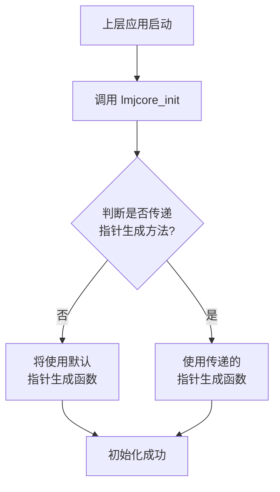
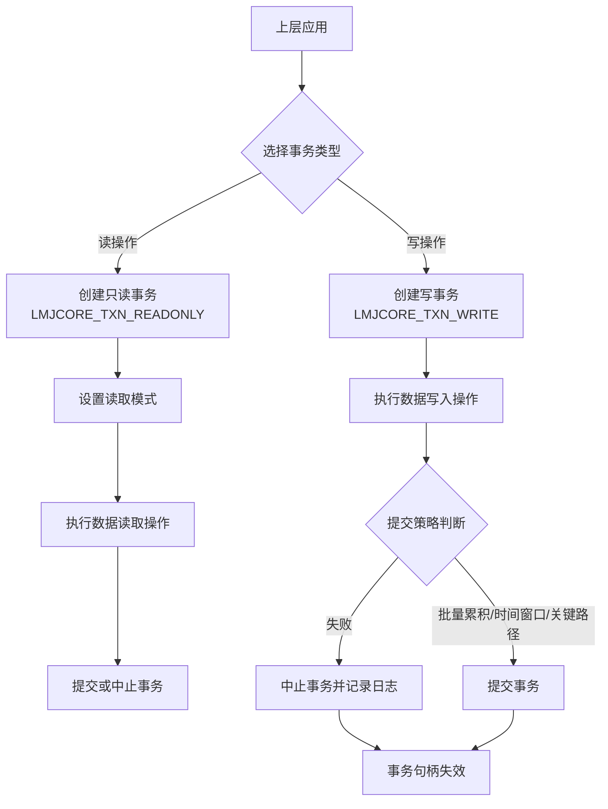
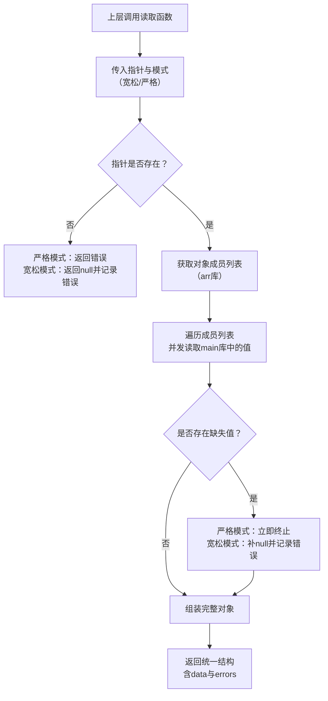
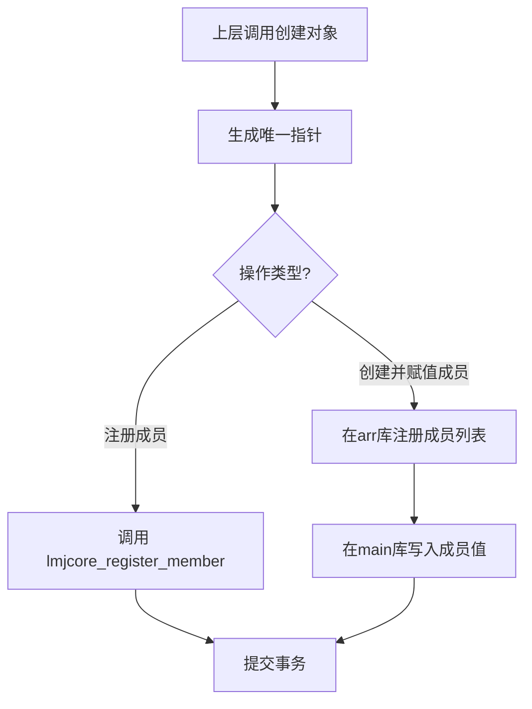
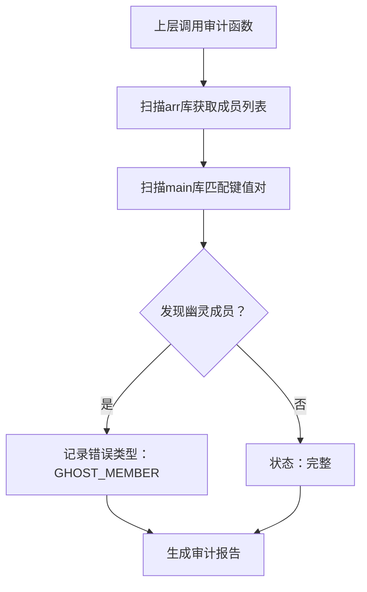
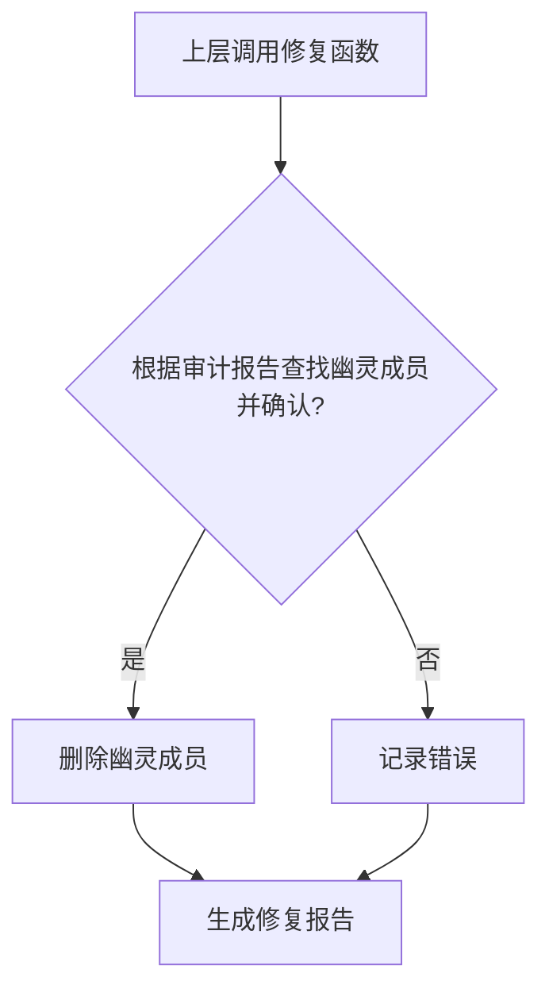

##  LMJCore 内核使用流程图

### 一、系统初始化流程

---

### 二、事务生命周期流程

---

### 三、数据读取流程（支持宽松/严格模式）

---

### 四、数据写入流程（对象创建）

---

### 五、数据审计与修复流程

> 并发窗口说明：
> 修复函数启动独立写事务，期间**阻塞所有其他写事务**；
> 上层在调用审计后、修复前**必须主动终止业务写入**，
> 否则可能因幽灵成员继续产生而导致修复失败。